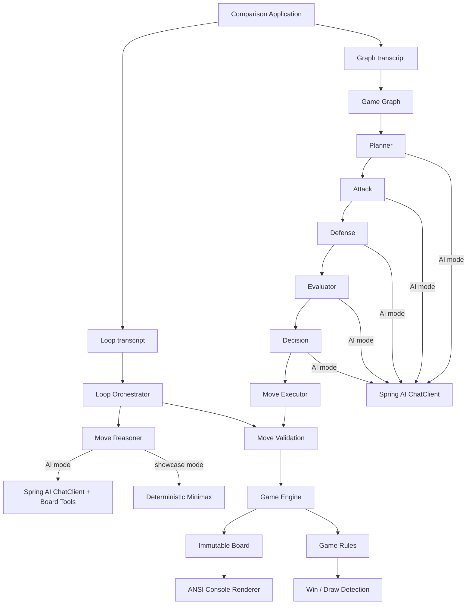
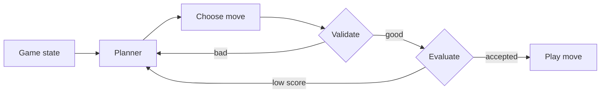
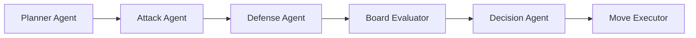

# Loop Engineering vs Graph Engineering

> One AI-powered Tic-Tac-Toe game. Two radically different orchestration architectures.


This console project makes an abstract architecture discussion visible.
Both applications play the same rules, use the same opponent moves, and render the same
board. The only variable is how intelligence is orchestrated.

## Definitions

### What is Loop Engineering?

Loop Engineering is an AI orchestration pattern in which one general-purpose reasoning
component repeatedly performs the same control cycle:

```text
observe → plan → propose → validate → evaluate → retry or execute
```

State and feedback return to the same agent on every iteration. This is compact and
effective when one prompt, one tool set, and one quality policy can safely own the complete
task. Its main scaling pressure is responsibility growth: planning, recovery, validation,
tool selection, and policy decisions gradually accumulate inside the same cycle.

### What is Graph Engineering?

Graph Engineering models an AI workflow as explicit nodes connected by directed edges.
Each node owns one responsibility, consumes typed state, and produces an output for the
next node or branch:

```text
specialized node → typed state → specialized node → deterministic boundary
```

The graph makes delegation, arbitration, branching, failure isolation, and per-agent
observability part of the architecture. It becomes valuable when multiple policies evolve
independently or the system must explain which specialist made each decision.

## Why this project exists

A single agent loop is often the fastest path to a useful AI feature. As the feature grows,
that loop accumulates planning, tool use, validation, retries, scoring, recovery, and policy.
It becomes difficult to observe and change one concern without disturbing the others.

Graph engineering promotes those concerns into explicit nodes with typed inputs and outputs.
That costs more structure up front, but gives complex agent systems clearer ownership,
targeted evaluation, safer evolution, and much better observability.

## Architecture


ai-tictactoe-demo
├── game-core       immutable board, rules, engine, console renderer
├── loop-engine     one reasoner inside a bounded validate/evaluate/retry loop
├── graph-engine    six specialist nodes connected through typed graph state
└── comparison-demo one-shot, side-by-side console recording


## End-to-end system design



### How one turn works

1. `GameEngine` exposes the immutable board and current player.
2. The selected orchestration architecture receives the same domain state.
3. Loop mode asks one reasoner for a structured `MoveCandidate`, validates it, scores it,
   and retries within a bounded attempt budget when necessary.
4. Graph mode passes immutable `GraphState` through Planner, Attack, Defense, Evaluator,
   and Decision nodes before reaching the executor.
5. Deterministic Java code validates the selected cell. A language model never mutates the
   board directly.
6. `GameEngine` applies the legal move and `GameRules` evaluates win, draw, or continuation.
7. The comparison module captures both traces and animates them in a fixed-height,
   side-by-side terminal dashboard.

### Runtime modes

| Mode | Purpose | Decision source |
|---|---|---|
| Showcase | Repeatable CI, reviews, and video recording | Local minimax/tactical agents |
| Spring AI | Real model-driven orchestration | `ChatClient`, structured output, tool calling |

`MoveReasoner` and `AgentIntelligence` isolate model providers from orchestration and domain
rules. Switching runtime modes does not change the game engine.

### Loop Engineering



`LoopOrchestrator` owns an explicit three-attempt budget. Each iteration asks one
`MoveReasoner` to do the whole cognitive job, validates its structured proposal, evaluates
the score, and either accepts or repeats. Spring AI mode also exposes board inspection as
tool calls through `ChatClient`.

This is compact, easy to start, and appropriate while the workflow is small.

### Graph Engineering



`GameGraph` passes immutable `GraphState` through specialized nodes. In AI mode, each
specialist executes an independent `ChatClient` request with its own externalized system
prompt and structured response contract. The executor is deliberately deterministic:
language models recommend; application code enforces invariants.

The sequential graph is intentionally easy to read on camera. Attack and Defense are
independent nodes and are natural candidates for parallel execution in a larger game.

## The practical difference

| Concern | Loop Engineering | Graph Engineering |
|---|---|---|
| Cognitive unit | One generalist | Multiple specialists |
| Control flow | Implicit retry cycle | Explicit typed nodes and edges |
| Prompt scope | Broad | Narrow, responsibility-specific |
| Failure isolation | Retry the whole thought | Retry or replace one node |
| Evaluation | One aggregate score | Per-agent outputs plus arbitration |
| Observability | Iteration-level | Node-level |
| Extension cost | Loop complexity grows | Add or branch a node |
| Best fit | Focused workflows | Evolving, multi-policy systems |

Graph engineering is not automatically better. It is better when coordination, independent
evaluation, branching, ownership, or failure isolation matter enough to justify the extra
structure.

## Run it

### Prerequisites

- JDK 25
- PowerShell, Bash, or an IntelliJ terminal
- An OpenAI API key only when real AI mode is enabled

Build and test all modules:

```powershell
.\mvnw.cmd clean verify
```

Run the recommended one-shot comparison view:

```powershell
.\mvnw.cmd -pl comparison-demo -am spring-boot:run
```

In IntelliJ, run
`com.fhy.tictactoe.comparison.ComparisonApplication`. It captures both complete
workflows first and then animates them in fixed-width Loop and Graph columns. The renderer
repaints one fixed-height dashboard instead of scrolling the terminal, pauses between
steps, and leaves the completed frame visible for recording.

Control the recording pace and dashboard height with environment variables:

```powershell
$env:DEMO_DELAY="1600ms"
$env:DEMO_VIEWPORT_LINES="24"
mvn -pl comparison-demo spring-boot:run
```

Run the loop demo in reproducible showcase mode:

```powershell
.\mvnw.cmd -pl loop-engine -am spring-boot:run
```

Run the graph demo:

```powershell
.\mvnw.cmd -pl graph-engine -am spring-boot:run
```

Showcase mode is the default. It uses a deterministic minimax/tactical implementation so
CI, reviewers, and video recordings work without credentials or network variability.

### Enable real Spring AI

```powershell
$env:AI_ENABLED="true"
$env:OPENAI_API_KEY="your-api-key"
$env:OPENAI_MODEL="gpt-5-mini"
.\mvnw.cmd -pl loop-engine -am spring-boot:run
```

Replace `loop-engine` with `graph-engine` for the multi-agent version. Configuration is
externalized; no secret belongs in source control. The OpenAI integration can be replaced
behind `MoveReasoner` or `AgentIntelligence` without touching the game domain.

## Console experience

ANSI color is enabled automatically in an interactive terminal and disabled for redirected
output and tests. The output uses a consistent visual language:

- cyan iteration events for the loop;
- individually colored graph agents;
- Unicode board, edges, cards, and result banners;
- concise rationales rather than hidden chain-of-thought;
- visible guardrails when an AI response is invalid.

### Screenshot placeholders

Add recorded assets to `docs/images/` when publishing:

- `loop-engine-console.png` — repeated reasoning and validation
- `graph-engine-console.png` — specialist node hand-offs
- `side-by-side.png` — identical board state, different orchestration


